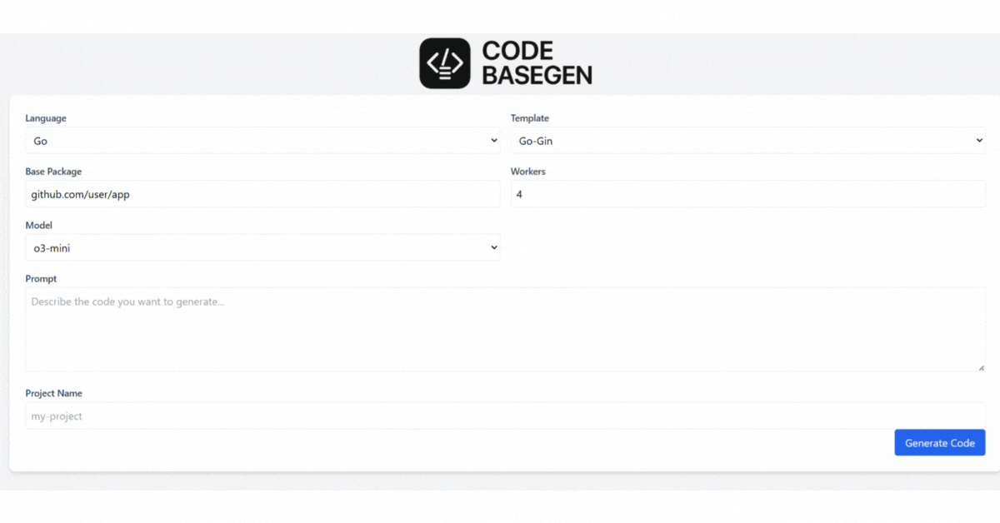

# Codebase Maker

Un generador de código inteligente que utiliza OpenAI para crear proyectos completos basados en descripciones en lenguaje natural. Soporta múltiples lenguajes de programación y frameworks populares. 🚨IMPORTANTE🚨  los prompts al momento de generar el codigo funcionan de forma inicial es en Inglés 

## 🎥 Demo



## 🚀 Características

- **Generación de código con IA**: Utiliza OpenAI GPT para generar código basado en descripciones en lenguaje natural
- **Múltiples lenguajes**: Soporta Go, Python, JavaScript y Java
- **Templates predefinidos**: Incluye templates para frameworks populares como:
  - **Go**: Gin framework
  - **Python**: Flask y Django
  - **JavaScript**: Express.js API
  - **Java**: Spring Boot
- **Dos modos de uso**: 
  - **CLI**: Para uso desde línea de comandos
  - **Servidor web**: Interfaz web con WebSocket para generación en tiempo real
- **Generación concurrente**: Múltiples workers para procesar archivos en paralelo
- **Descarga de proyectos**: Los proyectos generados se pueden descargar como archivos ZIP

## 📋 Prerrequisitos

- **Go 1.23.4** o superior
- **OpenAI API Key** - Necesario para la generación de código
- **Git** (opcional, para clonar el repositorio)

## 🛠️ Instalación

1. **Clona el repositorio**:
   ```bash
   git clone https://github.com/lFer17/codebase-maker.git
   cd codebase-maker
   ```

2. **Instala las dependencias**:
   ```bash
   go mod download
   ```

3. **Configura tu API Key de OpenAI**:
   
   **Opción A**: Variable de entorno
   ```bash
   export OPENAI_KEY="tu-api-key-aqui"
   ```
   
   **Opción B**: Archivo .env
   ```bash
   echo "OPENAI_KEY=tu-api-key-aqui" > .env
   ```

## 🏗️ Compilación

Compila ambos ejecutables (CLI y servidor):

```bash
make build
```

Esto generará:
- `./bin/maker` - Ejecutable CLI
- `./bin/maker-server` - Ejecutable del servidor web

## 📖 Uso

### Modo CLI (Línea de Comandos)

El modo CLI te permite generar código directamente desde la terminal.

#### Comandos básicos:

```bash
# Generar un proyecto básico
./bin/maker "crear una API REST con autenticación JWT"

# Listar templates disponibles
./bin/maker -list-templates

# Listar lenguajes soportados
./bin/maker -list-lenguages
```

#### Parámetros disponibles:

| Parámetro | Descripción | Valor por defecto |
|-----------|-------------|-------------------|
| `-openai-key` | API Key de OpenAI | Variable de entorno `OPENAI_KEY` |
| `-output-dir` | Directorio de salida | `./output` |
| `-base-package` | Paquete base para Go | `github.com/user/app` |
| `-worker-count` | Número de workers concurrentes | `4` |
| `-template` | Template a usar | `default` |
| `-language` | Lenguaje de programación | `go` |
| `-model` | Modelo de OpenAI | `gpt-4o-mini` |
| `-timeout` | Timeout para llamadas API (segundos) | `120` |

#### Ejemplos de uso:

```bash
# Generar una API REST con Go y Gin
./bin/maker -language go -template go-gin "crear una API REST para gestión de usuarios con CRUD completo"

# Generar una aplicación web con Python Flask
./bin/maker -language python -template python-flask "crear una aplicación web para blog con autenticación"

# Generar una API con Express.js
./bin/maker -language javascript -template js-express-api "crear una API para sistema de inventario"

# Generar una aplicación Java con Spring
./bin/maker -language java -template java-application "crear una aplicación de gestión de tareas"
```

### Modo Servidor Web

El modo servidor proporciona una interfaz web para generar código de forma interactiva.

#### Iniciar el servidor:

```bash
# Iniciar con configuración por defecto
./bin/maker-server

# Iniciar en puerto específico
./bin/maker-server -port 8080

# Especificar directorio de salida
./bin/maker-server -output-dir ./projects
```

#### Parámetros del servidor:

| Parámetro | Descripción | Valor por defecto |
|-----------|-------------|-------------------|
| `-openai-key` | API Key de OpenAI | Variable de entorno `OPENAI_KEY` |
| `-output-dir` | Directorio de salida | `./output` |
| `-port` | Puerto del servidor | `3000` |

#### Uso de la interfaz web:

1. **Abre tu navegador** y ve a `http://localhost:3000`
2. **Configura los parámetros**:
   - **Language**: Selecciona el lenguaje de programación
   - **Template**: Elige el framework/template
   - **Base Package**: Paquete base (para Go)
   - **Workers**: Número de workers concurrentes
   - **Model**: Modelo de OpenAI a usar
3. **Escribe tu prompt** describiendo el código que quieres generar
4. **Proporciona un nombre de proyecto**
5. **Haz clic en "Generate Code"**
6. **Monitorea el progreso** en tiempo real
7. **Descarga el proyecto** cuando termine la generación

## 🎯 Templates Disponibles

### Go
- **go-gin**: API REST con framework Gin
  - Estructura de proyecto Go estándar
  - Middleware de autenticación
  - Manejo de errores
  - Configuración de base de datos

### Python
- **python-flask**: Aplicación web con Flask
  - Estructura modular
  - Blueprints
  - Configuración de entorno
  - Templates HTML

- **python-django**: Aplicación web con Django
  - Estructura de proyecto Django
  - Apps modulares
  - Configuración de base de datos
  - Sistema de autenticación

### JavaScript
- **js-express-api**: API REST con Express.js
  - Estructura de proyecto Node.js
  - Middleware de autenticación
  - Validación de datos
  - Manejo de errores

### Java
- **java-application**: Aplicación Spring Boot
  - Estructura Maven/Gradle
  - Controladores REST
  - Servicios y repositorios
  - Configuración de aplicación

## 📁 Estructura del Proyecto

```
codebase-maker/
├── cmd/
│   ├── maker/          # Ejecutable CLI
│   └── server/         # Ejecutable del servidor web
├── internal/
│   └── agents/
│       ├── agent.go    # Lógica principal del agente
│       ├── openai.go   # Cliente de OpenAI
│       ├── parser.go   # Parser de respuestas
│       ├── server/     # Servidor web y WebSocket
│       └── templates/  # Templates de proyectos
├── web/
│   └── static/         # Interfaz web
├── Makefile           # Comandos de construcción
├── go.mod            # Dependencias de Go
└── README.md         # Este archivo
```

## 🔧 Configuración Avanzada

### Variables de Entorno

Puedes configurar el comportamiento usando variables de entorno:

```bash
export OPENAI_KEY="tu-api-key"
export OUTPUT_DIR="./my-projects"
export WORKER_COUNT=8
export OPENAI_MODEL="gpt-4o"
```

### Personalización de Templates

Los templates se encuentran en `internal/agents/templates/`. Cada template es un archivo JSON que define:

- **name**: Nombre del template
- **description**: Descripción del template
- **language**: Lenguaje de programación
- **prompt**: Prompt base para el template
- **files**: Archivos base del proyecto

## 🚨 Solución de Problemas

### Error: "Please Provide OpenAI API key"
- Asegúrate de que tu API key esté configurada correctamente
- Verifica que la variable de entorno `OPENAI_KEY` esté definida
- O usa el parámetro `-openai-key` al ejecutar el comando

### Error: "Invalid request"
- Verifica que tu prompt sea descriptivo y claro
- Asegúrate de que el template y lenguaje sean compatibles

### Error de timeout
- Aumenta el valor del parámetro `-timeout`
- Verifica tu conexión a internet
- Considera usar un modelo más rápido como `gpt-4o-mini`

### Problemas de compilación
- Asegúrate de tener Go 1.23.4 o superior instalado
- Ejecuta `go mod download` para instalar dependencias
- Verifica que todas las dependencias estén actualizadas


## 🔄 Changelog

### v1.0.0
- Soporte inicial para Go, Python, JavaScript y Java
- Templates para frameworks populares
- Modo CLI y servidor web
- Generación concurrente con múltiples workers
- Interfaz web con WebSocket para progreso en tiempo real 